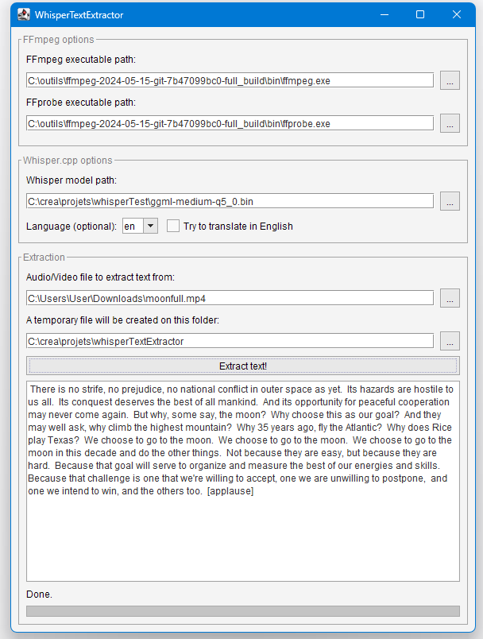

# WhisperTextExtractor

A Java frontend using [Whisper.ccp](https://github.com/GiviMAD/whisper-jni) + [FFmpeg](https://github.com/bramp/ffmpeg-cli-wrapper) to **extract text from an audio/video file**.

## How to use

1) Download a model from here (bigger size=slower but better quality, use "en" model for English text):  
[https://huggingface.co/ggerganov/whisper.cpp/tree/main](https://huggingface.co/ggerganov/whisper.cpp/tree/main)

2) Download ffmpeg:  
[https://ffmpeg.org/download.html](https://ffmpeg.org/download.html)

3) Enter the requested informations and click "Extract text!"